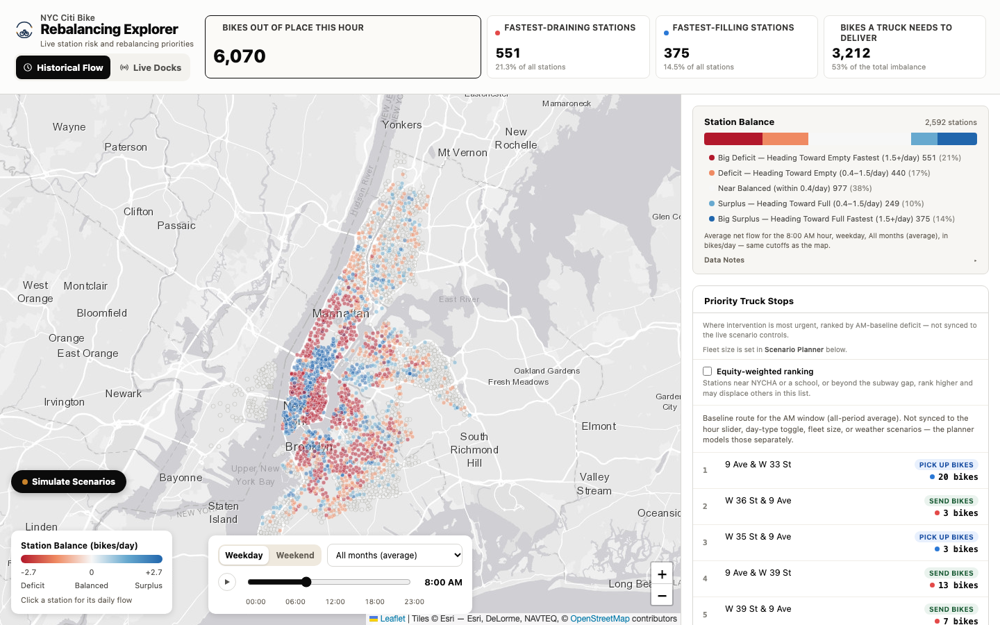
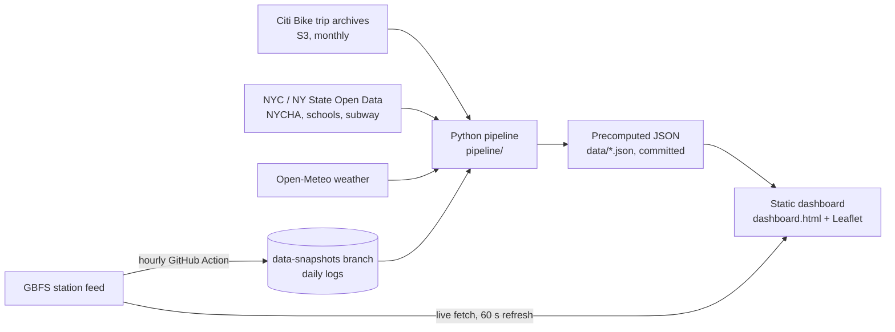

# NYC Citi Bike Rebalancing Explorer

[](https://nyc-citibike-rebalancing.vercel.app)
[](LICENSE)

**Live app:** https://nyc-citibike-rebalancing.vercel.app  
**Demo:** _coming soon_  
**Repo:** https://github.com/rezataeb/nyc-citibike-rebalancing



An interactive map of where Citi Bike stations run out of bikes or fill up
with them, and where a rebalancing truck would do the most good. Built as a
portfolio project for NYC DOT Bike Share & Shared Mobility reviewers, using
public data only and a $0 stack (static HTML plus precomputed JSON, no backend).

## Why this exists

A rider who finds an empty or full station may not take a bike at all, so
station imbalance is a barrier to mode choice, not just an operations
problem. The City's Citi Bike contract, as summarized in the NYC
Comptroller's review (*Riding Forward*), requires stations not to sit
completely full or empty, with the penalty applying only when adjacent
stations are also unavailable. This tool is a planning and oversight view
of that problem: where imbalance concentrates, how reliable stations have
actually been, who is affected (NYCHA, schools, subway gaps), and what a
fixed truck fleet could realistically cover.

The live "double-outage" indicator (an amber ring on the map) is a
point-in-time approximation of that adjacency rule. The 500 m definition of
"adjacent" is this project's own choice, not the contract's, and the
dashboard says so. It is not a penalty calculation.

## What it does

- **Historical Flow** -- per-station net flow (bikes/day) by hour, weekday or
  weekend, and season, from the Citi Bike trip archives.
- **Live Docks** -- current bike and dock availability from the public GBFS feed.
- **Priority Truck Stops** -- a baseline AM route ranked by deficit, with an
  optional equity-weighted ranking.
- **Scenario Planner** -- equity thresholds, a fleet-size simulator and a
  weather scenario, each reading precomputed files rather than running a
  model in the browser.
- **Reliability** -- how often each station was empty, full or offline in the
  GBFS log, and what station capacity predicts about it.

## What the data shows (and does not)

- Across **451,111 station observations** (Jul 13 -- Sep 13, 2026), stations
  were unusable (empty or full) **12.2%** of the time. Offline stations are
  excluded from that denominator.
- After accounting for demand, stations with 40+ docks are associated with
  unusable rates about **2.1 percentage points lower** than stations with
  under 20 docks (2,317 stations; a plain OLS fit). This is a pattern in
  observational data, not proof that adding docks causes better reliability.

## Limitations

- The reliability log is **irregularly sampled**: 191 snapshots over 61 days,
  with a median gap of about 87 minutes and one gap of several weeks. Rates
  are estimates from that sample, not continuous measurements.
- Borough and zone are not available in the pipeline, so the capacity
  analysis controls for demand only.
- The weather scenario projects from historical elasticities, not a
  weather-specific model. A heat-wave preset was left out on purpose because
  the fit does not support extrapolating that far.
- A dock-capacity "what if" sandbox was investigated and closed as not
  viable: public data only records momentary availability, never true
  capacity over time. See [`docs_v2/phase5-closeout.md`](docs_v2/phase5-closeout.md).

## System architecture



The dashboard runs entirely in the browser. Historical views, the Scenario
Planner and the reliability findings read precomputed files; nothing
re-runs a model live. Only **Live Docks** mode calls the public GBFS feed,
directly from the browser.

## Data provenance

| Layer | Source | Vintage / cadence | Used for |
|---|---|---|---|
| Station status | Citi Bike GBFS feed | Live, refreshed every 60 s in Live mode; logged hourly | Live Docks, reliability log |
| Trips | Citi Bike S3 trip archives | Monthly files: Sep 2025 -- Aug 2026, plus Jun 2025 | Net flow by hour, season, month |
| NYCHA developments | NYC Open Data `phvi-damg` (216 records) | Static snapshot | 300 m equity proximity |
| Schools | NYC Open Data `wg9x-4ke6` (1,899 records) | 2019--2020 locations; the only coordinate-bearing school dataset on NYC Open Data when checked | 300 m equity proximity |
| Subway stations | NY State Open Data `i9wp-a4ja` (2,120 records) | Static snapshot | 800 m subway-gap distance |
| Weather | Open-Meteo | Historical | Temperature and precipitation elasticities |

Quality rules: trips under 60 seconds or over 4 hours are dropped;
low-volume stations are excluded from forecasting; offline stations are
excluded from failure denominators. Full school-dataset provenance:
[`docs_v2/Dashboard_v2_Redesign_Working_Notes.md`](docs_v2/Dashboard_v2_Redesign_Working_Notes.md).

## Tech stack

| Layer | Tech |
|---|---|
| Frontend | Single `dashboard.html`, vanilla JS, Leaflet, no build step |
| Data pipeline | Python 3, pandas, scikit-learn, scipy, shapely, pyarrow |
| Tests | pytest (Python), Node `vm`-based harness (dashboard JS) |
| Data collection | GitHub Actions, hourly GBFS snapshot |
| Hosting | Vercel (static), deployed manually |
| Backend / DB / auth | None |

## Run locally

```bash
git clone https://github.com/rezataeb/nyc-citibike-rebalancing
cd nyc-citibike-rebalancing
python3 -m http.server 8000
```

Open **http://localhost:8000/dashboard.html**. No install step is needed to
view the dashboard. To run the Python pipeline or tests, first
`pip install -r requirements.txt`.

`dashboard.html` fetches its data files (`data/flows.json`,
`data/live_status.json`) with `fetch()`, which browsers block when a page is
opened directly from disk (`file://...`) for security reasons -- the fetch
rejects before a response ever comes back. **Double-clicking `dashboard.html`
will not work.**

Serve this directory over plain HTTP instead:

```
python3 -m http.server 8000
```

then open **http://localhost:8000/dashboard.html** in a browser.

The canonical, deployed copy is **https://nyc-citibike-rebalancing.vercel.app/**
(a static Vercel deployment of this same directory, `dashboard.html` served
at the root, `data/*.json` alongside it) -- opening that URL directly works
with no extra steps, since the `file://` restriction above only affects
local, on-disk viewing.

## Project structure

```
.
├── dashboard.html        # the whole frontend: HTML, CSS, vanilla JS
├── data/                 # precomputed JSON/parquet the dashboard reads
│   └── gbfs_log/         # GBFS snapshots up to the switch-over (see below)
├── pipeline/             # Python: download, QC, flows, equity join,
│                         #   elasticities, fleet simulator, reliability
├── tests/                # pytest + dashboard JS test suites
├── notebooks/            # exploratory data analysis report
├── docs/                 # screenshots and design mockup
├── docs_v2/              # working notes and the Phase 5 closeout
├── .github/workflows/    # hourly GBFS snapshot job
└── vercel.json           # static deploy config
```

## Snapshot data

An hourly GitHub Actions job logs the GBFS feed. Those commits go to the
**`data-snapshots`** branch, not `master`, to keep this history readable.
`master` holds the snapshot files up to the switch-over; to re-run
`pipeline/reliability.py` on the full log, copy
`data/gbfs_log/snapshots_*.csv` from `data-snapshots` into your checkout
first.

## Reproducing the pipeline

Every number in `data/*.json` and `data/*.parquet` is derived from public
data (Citi Bike S3 trip archives, GBFS, NYC Open Data, Open-Meteo) by code
in `pipeline/`, and those derived files are themselves committed to this
repo -- a reviewer doesn't need to run anything to see the numbers the
dashboard shows. This section is for actually re-deriving them, to check
that they hold up.

```
python3 -m pipeline.reproduce_all --skip-download   # fast path, ~20-40 min
python3 -m pipeline.reproduce_all                    # full path, ~1-2 hours, several GB
```

**`--skip-download` (the fast path, and the one most reviewers actually
want):** reuses the already git-committed `data/flows.json` and
`data/daily_net_flow.parquet` instead of re-downloading twelve months of
real trip archives, then re-runs everything downstream of them --
elasticities, the 12-fold walk-forward model, fleet scenarios, the route
plan, weather presets, and finally `pipeline/spot_check.py`'s ground-truth
checks against the freshly-reproduced output. Fails loudly (`SystemExit`)
if those two committed files are somehow missing, rather than silently
trying to proceed without them.

**Full path (no `--skip-download`):** also re-downloads and re-aggregates
all twelve months of real Citi Bike trip archives via
`pipeline/build_full_year.py` first -- several GB of network traffic,
realistically 30-60+ minutes just for that step, then the same downstream
chain as above. This is the real end-to-end proof the pipeline reproduces
from nothing but public data; run it if you want that proof, not
routinely.

**One real, unavoidable non-reproducibility caveat, stated plainly rather
than implied away:** `pipeline/gbfs_logger.py --live` pulls the *live*
GBFS feed at whatever moment you run it -- there's no way to reproduce the
exact station roster/capacity a past run saw, because that data doesn't
exist historically anywhere public. Every run of `reproduce_all.py`
refreshes `data/live_status.json` fresh before elasticities, by design --
so `elasticities.json`'s capacity-derived numbers (`capacity_elasticity`
and related fields) will always drift slightly from whatever is currently
committed. This is real drift, not a bug: it was found and fixed once
already (Session 40) when the committed `elasticities.json` turned out to
have been quietly built against a `live_status.json` snapshot 9 days
stale. Everything else -- the raw trip archives, Open-Meteo's historical
weather archive, the fixed 6km weather grid -- is real historical data and
should reproduce identically.

`data/gbfs_log/` (the continuously-collected live-density log behind
Investigator Mode's deferred Phase 5 -- one `snapshots_YYYY-MM-DD.csv`
file per UTC day since Session 71, plus the frozen pre-rotation
`snapshots.csv`) is a separate artifact neither reproduction path touches
-- it only grows via the GitHub Actions cron
(`.github/workflows/gbfs_snapshot.yml`) accumulating real snapshots over
real elapsed time, and ships as-is in git. The single-file version hit
GitHub's 100MB per-file push limit in August 2026, silently losing every
snapshot until the rotation fix -- `pipeline/reliability.py` reads every
file in the directory together, so that gap is the only real loss.

See `pipeline/reproduce_all.py`'s own module docstring for the full,
ordered step list and each step's real cost.

## Scenario Planner

(Named "Investigator Mode" through early development -- renamed in the
dashboard's UI, DOM, and JS; this doc's own Phase numbering below still
refers to `Investigator_Mode_Guideline.md` by its original name.)

A collapsed-by-default panel ("Scenario Planner") that turns the map from
a report into a "what if" sandbox. Every control reads a precomputed JSON
file -- nothing here re-runs a model live in the browser. All three
controls below have their own graceful degradation: a control simply
doesn't appear if its data file failed to load.

### Equity thresholds
Two sliders (NYCHA/school proximity, default 300m; subway gap, default
800m) recompute live station counts directly from each station's raw
distances already in `data/flows.json`'s `context` block -- not the fixed-
threshold flags baked in at build time. Reports a combined ("NYCHA or
school") and overlap ("NYCHA and school") count alongside the two
individual ones, so the flagged population is legible, not just three
numbers that could hide overlap. No map recoloring or filtering -- this is
a live count only, a deliberate scope boundary (see `CLAUDE.md`'s standing
exclusion of a map-level equity filter).

### Fleet simulator
A slider (1-10 trucks) reads one of ten precomputed scenarios in
`data/fleet_scenarios.json` (`pipeline/fleet_simulator.py`) and swaps them
into the same route layer/toggle the historical "Show route" control uses.
**Caveat, checked against real data rather than assumed:** marginal
benefit per truck does not diminish smoothly across any realistic fleet
size -- every truck in every scenario (1 through 40, checked) hits its own
45-stop shift cap before ever running out of flagged stations. The binding
constraint is each truck's own per-shift stop budget, not overall demand.

### Weather scenario
A preset dropdown (`rain_day`, `snow_day`, `ideal`) plus manual
temperature/precipitation sliders project each station's baseline flow
through its own capacity/temp/precip elasticity
(`pipeline/elasticities.py`, `data/elasticities.json`) -- station-specific
if available, else its typology group's, else left unadjusted for stations
with neither. **Estimated from historical elasticity, not a
weather-specific model** -- shown explicitly in the panel itself. A
`heat_wave` preset was deliberately excluded: the elasticity fit has only
5 distinct training values for temp/precip, and the top observed point
shows a sharp, likely-artifactual jump, so a 95°F scenario would
extrapolate from that specific unreliable segment.

### Diff bar, save/load preset, reset to baseline
Once any control moves from its own default, a persistent diff bar
(visible even with the panel collapsed) summarizes baseline vs. scenario
for all three controls together. "Save preset" produces a shareable URL
encoding the current state; opening that URL re-applies it automatically.
"Reset to baseline" returns all three controls to their defaults.

### Dock capacity sandbox (deferred)
The Guideline's original Phase 5 (adjust a station's capacity, project a
change in empty-minutes risk) is deferred, not built as a scoped/proxy
version -- see `PROGRESS.md`'s Deferred list for the two independent
blockers (GBFS log density far short of the statistical target, and no
risk-based elasticity has been fit against real empty/full observations).
No dock-capacity JSON file exists yet; the fourth `investigatorState`
field (`dockOverrides`) isn't part of the current schema, and existing
graceful degradation means a future addition won't break anything saved
today -- a preset saved now simply has no `dockOverrides` key, which loads
as "no overrides" once that field exists.

## License and disclaimer

Released under the [MIT License](LICENSE). Citi Bike, NYC Open Data and
Open-Meteo data remain subject to their own terms.

This is an independent analytical project. It is not an official product of
the NYC Department of Transportation, the NYC Comptroller, or Lyft/Citi Bike.

## Contact

Reza Taeb -- [taeb.reza@gmail.com](mailto:taeb.reza@gmail.com)
